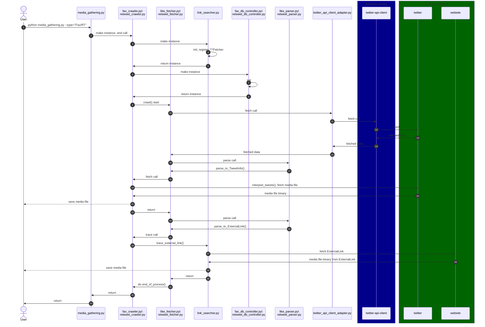

```mermaid
sequenceDiagram
    autonumber

    actor User
    participant media_gathering.py
    participant crawler as fav_crawler.py\<br/>retweet_crawler.py
    participant fetcher as like_fetcher.py\<br/>retweet_fetcher.py
    participant link_searcher.py
    participant db as fav_db_controller.py\<br/>retweet_db_controller.py
    participant parser as like_parser.py\<br/>retweet_parser.py
    participant twitter_api_client_adapter.py

    box DarkBlue External Library
    participant twitter-api-client
    end

    box DarkGreen External Network
    participant twitter
    participant website
    end

    User ->> media_gathering.py: python media_gathering.py --type="Fav/RT"
    media_gathering.py ->> crawler : make instance, and call

    crawler ->> link_searcher.py: make instance
    link_searcher.py ->> link_searcher.py: init, register ***Fetcher
    link_searcher.py ->> crawler: return instance

    crawler ->> db: make instance
    db ->> db: init
    db ->> crawler: return instance

    crawler ->> fetcher: crawl() start
    fetcher ->> twitter_api_client_adapter.py: fetch call
    twitter_api_client_adapter.py ->> twitter-api-client: fetch call
    twitter-api-client ->> twitter: fetch
    twitter ->> twitter-api-client: fetched data
    twitter-api-client ->> twitter_api_client_adapter.py: fetched data
    twitter_api_client_adapter.py ->> fetcher: fetched data

    fetcher ->> parser: parse call
    parser ->> fetcher: parse_to_TweetInfo()
    fetcher ->> crawler: fetch call
    crawler ->> twitter: interpret_tweets(), fetch media file
    twitter ->> crawler: media file binary
    crawler -->> User: save media file
    crawler ->> fetcher: return 

    fetcher ->> parser: parse call
    parser ->> fetcher: parse_to_ExternalLink()
    fetcher ->> crawler: trace call
    crawler ->> link_searcher.py: trace_external_link()
    link_searcher.py ->> website: fetch ExternalLink
    website ->> link_searcher.py: media file binary from ExternalLink
    link_searcher.py -->> User: save media file
    link_searcher.py ->> fetcher: return 

    fetcher ->> crawler: do end_of_process()
    crawler ->> media_gathering.py: return
    media_gathering.py ->> User: return
```