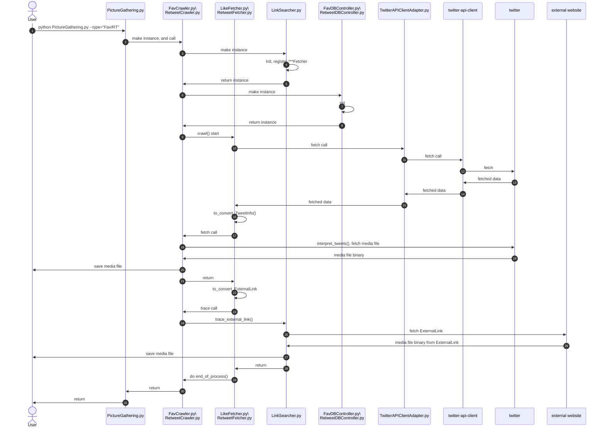

```mermaid
sequenceDiagram
    autonumber

    actor User
    participant PictureGathering.py
    participant crawler as FavCrawler.py\<br/>RetweetCrawler.py
    participant fetcher as LikeFetcher.py\<br/>RetweetFetcher.py
    participant LinkSearcher.py
    participant db as FavDBController.py\<br/>RetweetDBController.py
    participant TwitterAPIClientAdapter.py
    participant twitter-api-client
    participant twitter
    participant external website

    User ->> PictureGathering.py: python PictureGathering.py --type="Fav/RT"
    PictureGathering.py ->> crawler : make instance, and call

    crawler ->> LinkSearcher.py: make instance
    LinkSearcher.py ->> LinkSearcher.py: init, register ***Fetcher
    LinkSearcher.py ->> crawler: return instance

    crawler ->> db: make instance
    db ->> db: init
    db ->> crawler: return instance

    crawler ->> fetcher: crawl() start
    fetcher ->> TwitterAPIClientAdapter.py: fetch call
    TwitterAPIClientAdapter.py ->> twitter-api-client: fetch call
    twitter-api-client ->> twitter: fetch
    twitter ->> twitter-api-client: fetched data
    twitter-api-client ->> TwitterAPIClientAdapter.py: fetched data
    TwitterAPIClientAdapter.py ->> fetcher: fetched data

    fetcher ->> fetcher: to_convert_TweetInfo()
    fetcher ->> crawler: fetch call
    crawler ->> twitter: interpret_tweets(), fetch media file
    twitter ->> crawler: media file binary
    crawler ->> User: save media file
    crawler ->> fetcher: return 

    fetcher ->> fetcher: to_convert_ExternalLink
    fetcher ->> crawler: trace call
    crawler ->> LinkSearcher.py: trace_external_link()
    LinkSearcher.py ->> external website: fetch ExternalLink
    external website ->> LinkSearcher.py: media file binary from ExternalLink
    LinkSearcher.py ->> User: save media file
    LinkSearcher.py ->> fetcher: return 

    fetcher ->> crawler: do end_of_process()
    crawler ->> PictureGathering.py: return
    PictureGathering.py ->> User: return
```